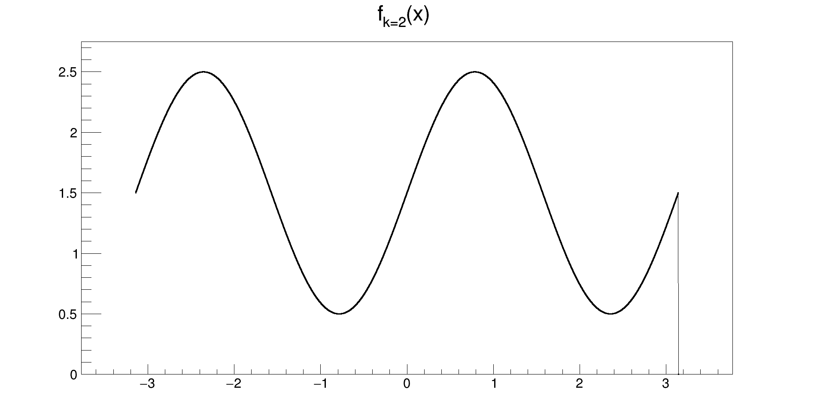
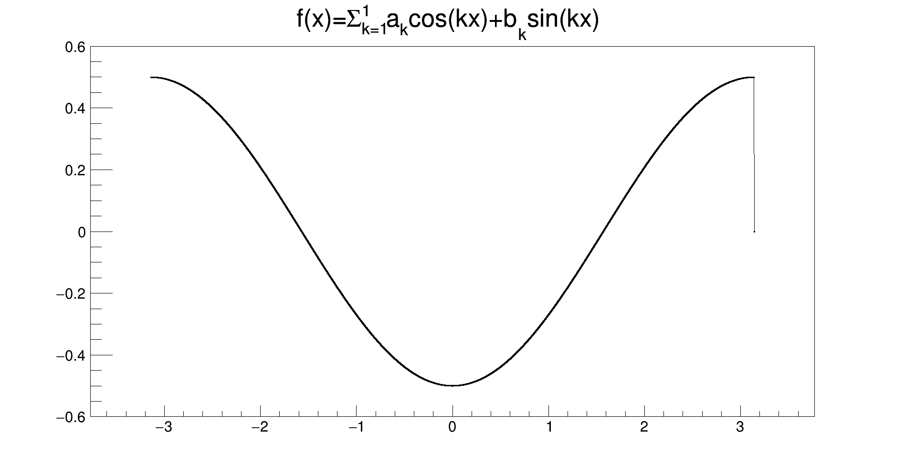
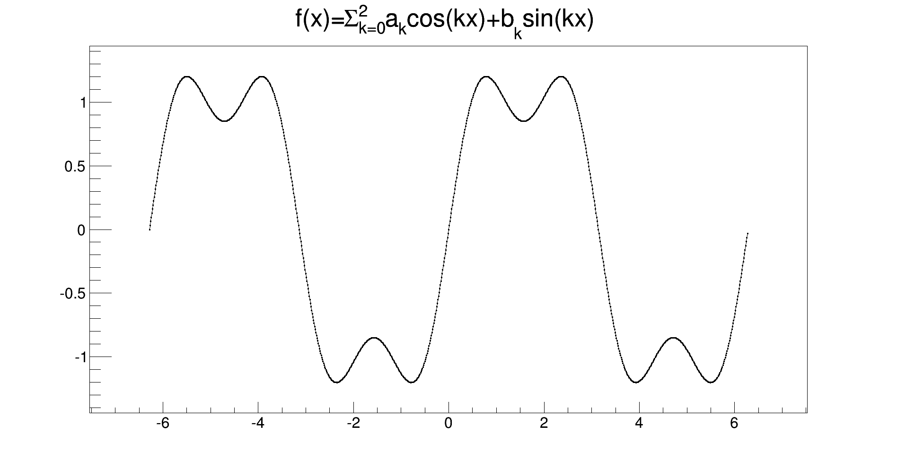
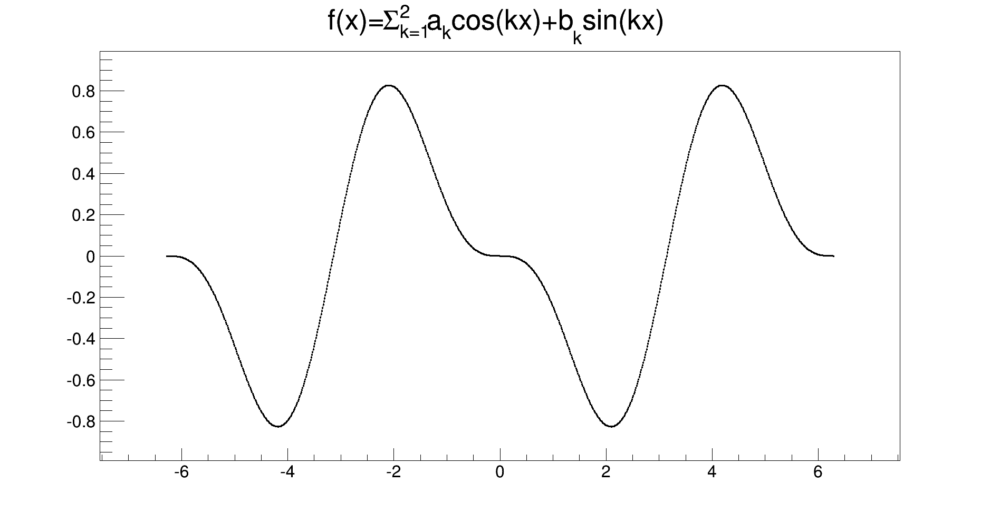
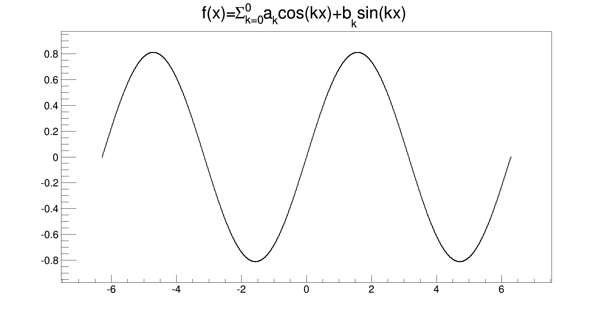

## Seccessions of functions, Series and Fouries Series. 1-dimensional, f: \R -> \R

Code developed during the second year of my bachelor, while studying for the calculus exam. 

ACHTUNG! This has been written by `past-me`, please show some understanding, he had only just started coding. This has been one of his first small projects. I know, it's awful to configure and to change the function parameters

Given a succession of functions `f_k(x)` with `k \in Z`, 

- `succession.cpp` plots all the `f(x) = f_k(x)` one after the other
- `fourier-series.cpp` plots `f(x)=\Sum_{k=%d}^{%d}a_{k}cos(kx)+b_{k}sin(kx)` one after the other

I used [ROOT](https://root.cern) to plot the functions and create a gif file.

Wish list for future improvements (no, do not expect these coming from me)
- improve configuration
  - it would be nice to separate the configuration from the source code, while maintaining the generality
- improve performance
  - it is super, there is a lot to improve in how the functions are defined and in how root objects are accessed (to change the range on ay axis, for example)

## Examples

`f(x) = sin (k * x), x \in [-pi, pi]`



`f(x) = 0 if x \in [-pi, 0], = -cos(x) if x \in [0, pi]` approximated with Fourier Series



`f(x) = abs(x), x \in [-pi, pi]` approximated with Fourier Series

.gif)

`f(x) = periodic_step(x), x \in [-2pi, pi]` approximated with Fourier Series



`f(x) = sawtooth(x), x \in [-2pi, pi]` approximated with Fourier Series



`f(x) = triangle(x), x \in [-2pi, pi]` approximated with Fourier Series




## Run and replicate the results

Run with `ROOT` docker:

```bash
# tested GNU/Linux, maybe it works on OSX also.
docker run \
-v /host/directory/series-functions:/src \
-v ~/temp/docker-root/:/root: \
-e DISPLAY=$DISPLAY \
-v /tmp/.X11-unix:/tmp/.X11-unix \
--user (id -u):(id -g) \
--rm -it \
rootproject/root bash

cd /src
g++ -o four fourier-series.cpp `root-config --cflags --glibs`
./four
```
